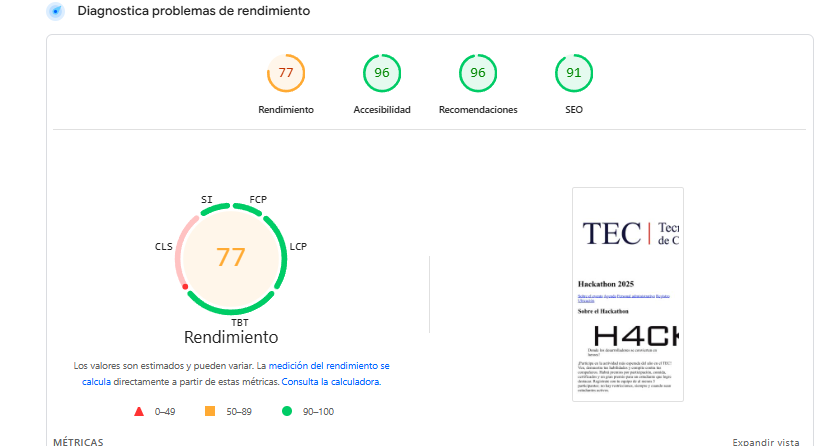

# Hackathon 2025

Bienvenido al sitio oficial del **Hackathon 2025** en el TEC Centro Académico de Limón.  
Este sitio web presenta la información del evento, agenda, registro de equipos, ubicaciones y patrocinadores, usando HTML semántico y buenas prácticas de accesibilidad.

---

## Estructura semántica

El sitio utiliza las siguientes etiquetas clave:

- `<header>`: Contiene el logo, título y menú de navegación.
- `<nav>`: Menú con enlaces internos a secciones principales.
- `<main>`: Contenido principal del sitio.
- `<section>`: Secciones como "Sobre el evento", "Agenda", "Registro", etc.
- `<article>`: Información individual de cada miembro del personal administrativo.
- `<aside>`: Información complementaria, como el premio del Hackathon.
- `<figure>` y `<figcaption>`: Imagen alusiva al evento con su descripción.
- `<footer>`: Información de contacto y derechos de autor.
- `<form>`: Registro de equipos con campos de texto, teléfono y radio buttons.
- `<table>`: Tabla de equipos registrados.
- `<blockquote>`: Cita destacada de Albert Einstein.

---

## URL pública

El sitio está desplegado en Netlify y puede visitarse en:  
 [Hackathon TEC 2025](https://hackathontec.netlify.app/)

---

## Validación W3C

- Se validó el HTML con el [Validador de W3C](https://validator.w3.org/).
- **Resumen**: El documento cumple con la mayoría de las normas, incluyendo uso de etiquetas semánticas, atributos `alt` en imágenes y jerarquía de encabezados.
- 
- 

---

## Lighthouse

Se ejecutó Lighthouse sobre la URL de Netlify seleccionando las categorías:

| Categoría       | Puntuación |
| --------------- | ---------- |
| Accessibility   | 96/100     |
| SEO             | 91/100     |
| Recomendaciones | 100/100    |

- **Capturas:**  
  

- **Plan de mejoras accessibility :**
  - Mejorar el tamaño y separacion de los patrocinadores
- **Plan de mejoras SEO :**  
  -Se pueden incluir metadescripciones en los resultados de la búsqueda para resumir el contenido de la página.

---

## Accesibilidad aplicada

- **`tabindex`**:

  - Imagen del premio `tabindex="-1"` → permite saltar la imagen en el tabulado si se desea.
  - Foto de Elder `tabindex="0"` → accesible con teclado, destacando información importante.

- **`aria-label`**:

  - Botón de registro con `aria-label="Enviar registro al evento"` → proporciona contexto a lectores de pantalla.

- **`alt`**:

  - Todas las imágenes incluyen texto alternativo descriptivo, por ejemplo: `"Premio mayor del hackathon"`.

- **Enlaces descriptivos**:
  - Menú y enlaces externos usan texto claro, por ejemplo: `"Ver en Google Maps"`, `"Extreme Tech"`, `"TEC Costa Rica"`.

---
